https://github.com/Dinesh7318/Ex02-Outlier.git

https://colab.research.google.com/drive/1stVl6PFIwW8wT4OvJLedbki8EuxmOZLH?usp=sharing

# Ex02-Outlier

You are given bhp.csv which contains property prices in the city of banglore, India. You need to examine price_per_sqft column and do following,

(1) Remove outliers using IQR 

(2) After removing outliers in step 1, you get a new dataframe.

(3) use zscore of 3 to remove outliers. This is quite similar to IQR and you will get exact same result

(4) for the data set height_weight.csv find the following

    (i) Using IQR detect weight outliers and print them

    (ii) Using IQR, detect height outliers and print them

## Aim:
TO detect and remove the outliers in the given data set and save the final data.
## Algorithm:

### Step 1
Import the required packages(pandas,numpy,scipy)

### Step 2
Read the given csv file

### Step 3
Convert the file into a dataframe and get information of the data.

### Step 4
Remove the non numerical data columns using drop() method.

### Step 5
Detect the outliers in the data set using z scores method.

### Step 6
Remove the outliers by z scores and list manupilation or by using Interquartile Range(IQR)

### Step 7
Check if the outliersare removed from data set using graphical methods.

### Step 8
Save the final data set into the file.
## Program:

### 1) & (2) Examine price_per_sqft column and use IQR to remove outliers and create new dataframe
```
import pandas as pd
import numpy as np
import seaborn as sns

df = pd.read_csv("/content/bhp.csv")
df

df.head()

df.describe()

df.info()

df.isnull().sum()

df.shape

sns.boxplot(x="price_per_sqft",data=df)

q1 = df['price_per_sqft'].quantile(0.25)
q3 = df['price_per_sqft'].quantile(0.75)
print("First Quantile =",q1,"\nSecond Quantile =",q3)

IQR = q3-q1
ul = q3+1.5*IQR
ll = q1-1.5*IQR

df1 =df[((df['price_per_sqft']>=ll)&(df['price_per_sqft']<=ul))]
df1

df1.shape

sns.boxplot(x="price_per_sqft",data=df1)
``` 
### (3)Examine price_per_sqft column and use zscore of 3 to remove outliers.
```
from scipy import stats
z = np.abs(stats.zscore(df['price_per_sqft']))
df2 = df[(z<3)]
df2

print(df2.shape)
sns.boxplot(x="price_per_sqft",data=df2)
```
### (4)(i) For the data set height_weight.csv detect weight outliers using IQR method
```
df3 = pd.read_csv("height_weight.csv")
df3

df3.head()

df3.info()

df3.describe()

df3.isnull().sum()

df3.shape

sns.boxplot(x="weight",data=df3)

q1 = df3['weight'].quantile(0.25)
q3 = df3['weight'].quantile(0.75)
print("First Quantile =",q1,"\nSecond Quantile =",q3)

IQR = q3-q1
ul = q3+1.5*IQR
ll = q1-1.5*IQR

df4 =df3[((df3['weight']>=ll)&(df3['weight']<=ul))]
df4

df4.shape

sns.boxplot(x="weight",data=df4)
```
### (4)(ii) For the data set height_weight.csv detect height outliers using IQR method.
```
sns.boxplot(x="height",data=df3)
q1 = df3['height'].quantile(0.25)
q3 = df3['height'].quantile(0.75)
print("First Quantile =",q1,"\nSecond Quantile =",q3)

IQR = q3-q1
ul = q3+1.5*IQR
ll = q1-1.5*IQR

df5 =df3[((df3['height']>=ll)&(df3['height']<=ul))]
df5

df5.shape

sns.boxplot(x="height",data=df5)

```
 ## Output:
 ### (1)(2) Examine price_per_sqft column and use IQR to remove outliers and create new dataframe.
 #### Dataset
 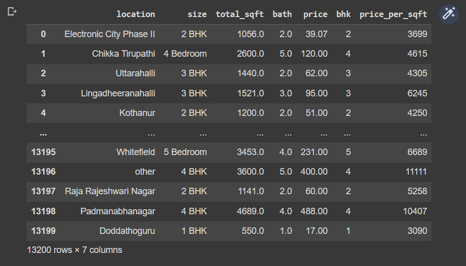

 #### Dataset Head :
 

 #### Dataset Info :
 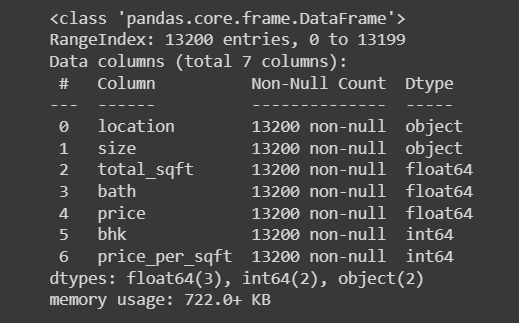

 #### Dataset Describe:
 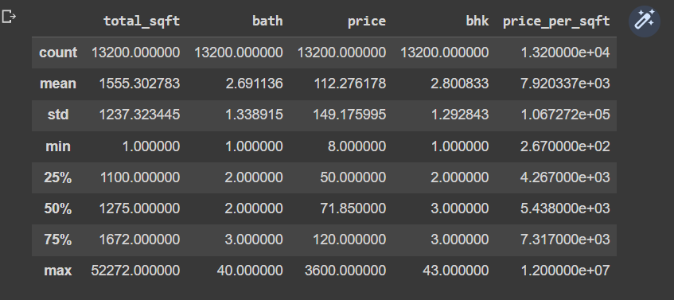

 #### Null Values:
 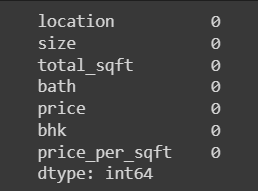

 #### Dataset Shape:
 

 #### Box plot of price_per_sqft column with outliers:
 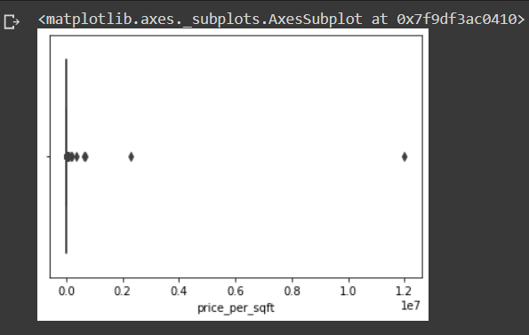

 #### price_per_sqft - Dataset after removing outliers:
 
 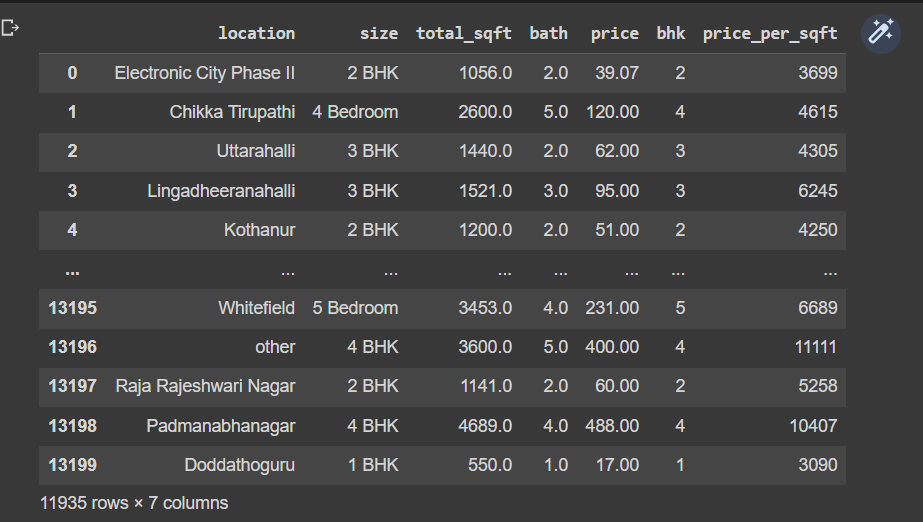

 #### Box Plot of price_per_sqft column without outliers:
 

 ### (3) Examine price_per_sqft column and use zscore of 3 to remove outliers.
 #### Dataset after removal of outlier using z score:
 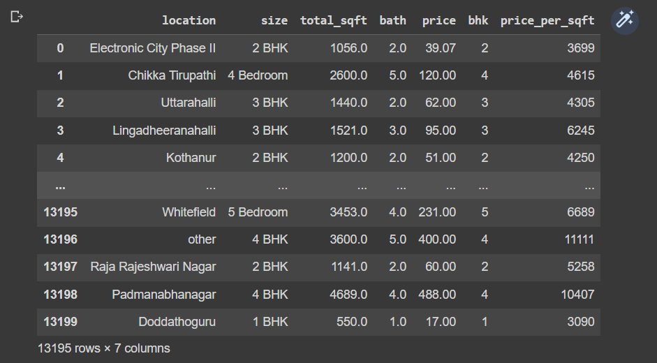

 #### Shape of Dataset after removal of outlier using z score:
 

 #### price_per_sqft column after removing outliers:
 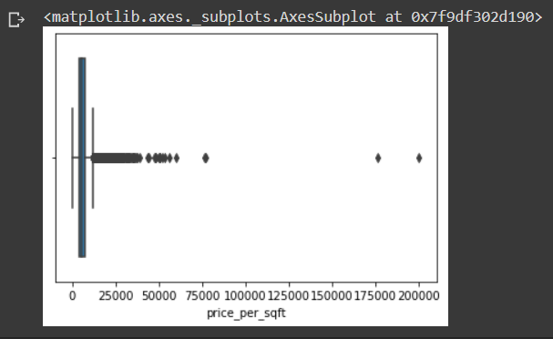

 ### (4) For the data set height_weight.csv detect weight and height outliers using IQR method:
 #### Dataset:
 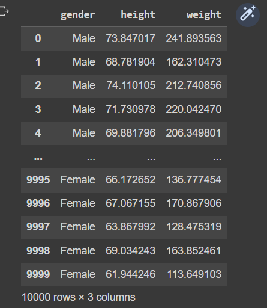

 #### Dataset Head:
 

 #### Dataset Info:
 

 #### Dataset Describe:
 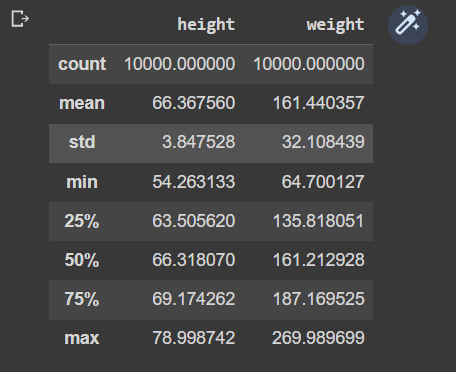
#### Null Values:
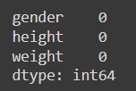
#### Dataset Shape:


#### Weight - With outliers:


#### Weight - Dataset after removing Outliers using IQR method:
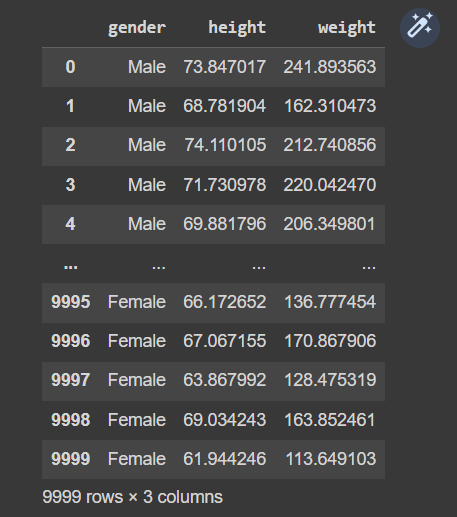

#### Weight - Shape of Dataset after removing Outliers using IQR method:


#### Weight - Without Outliers using IQR method:


#### Height - With outliers:
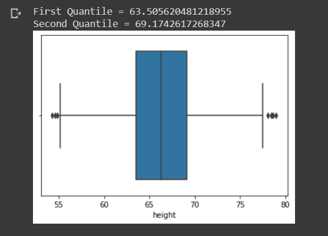

#### Height - Dataset after removing Outliers using IQR method:


#### Height - Shape of Dataset after removing Outliers using IQR method:


#### Height - Without Outliers using IQR method:
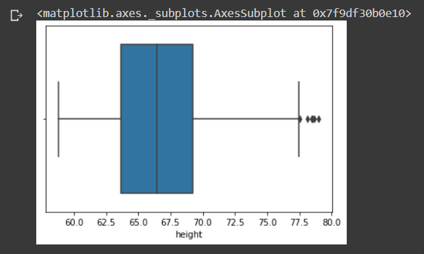
## Result:
Thus the outliers are detected and removed in the given file and the final data set is saved into the file.
